<picture>
  <source media="(prefers-color-scheme: dark)" srcset="./assets/banners/banner-dark.svg">
  <source media="(prefers-color-scheme: light)" srcset="./assets/banners/banner-light.svg">
  
</picture>

<br>

<div align="center">

## Infrastructure • Cybersecurity • Microsoft Cloud • Automation

Administrateur cybersécurité spécialisé dans l'infogérance,
l'administration, la sécurisation et l'évolution d'infrastructures IT.

</div>

<br>

<picture>
  <source media="(prefers-color-scheme: dark)" srcset="./assets/dividers/divider-dark.svg">
  <source media="(prefers-color-scheme: light)" srcset="./assets/dividers/divider-light.svg">
  
</picture>

## About Me

```yaml
name: Alexandre Dufour

role:
  Cybersecurity Administrator

education:
  BAC+5 E3IN Cybersecurity
  ESIEE-IT

specializations:
  - Cybersecurity
  - System Administration
  - Network Administration
  - Microsoft Cloud
  - Virtualization
  - Backup
  - Automation
  - IT Support
